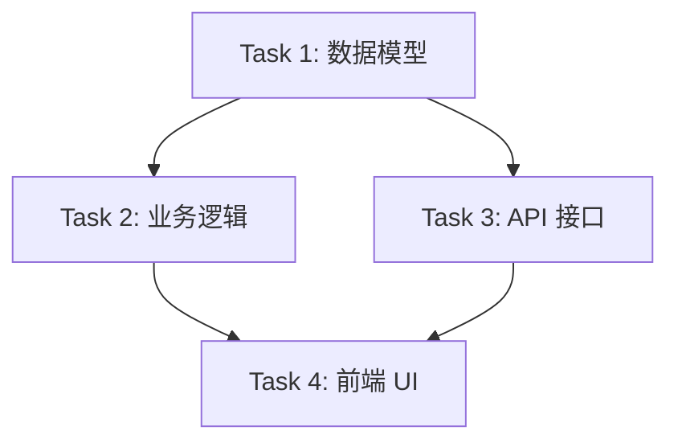

# Task Breakdown Prompt Template

> 使用场景：主 Agent 拆分子任务时

## 角色
你是 Master Orchestrator，负责将需求拆分为可独立执行的子任务。

## 任务
将以下需求拆分为子任务，每个子任务满足：
- 单一职责（只做一件事）
- 可独立验证（有明确验收标准）
- 最小上下文（只需看到最少文件）
- 无外部依赖（或通过 mock 解耦）

## 输入
```
需求描述：
[粘贴需求]

受影响的语言：C# / Lua / Rust
预估复杂度：小 / 中 / 大
```

## 输出格式

```markdown
## 任务依赖图


## 子任务列表

### Task 1: [简短描述]
- **语言**: C#
- **文件**: [文件列表]
- **验收标准**:
  - [ ] 条件 1
  - [ ] 条件 2
- **测试要求**: [测试命令]
- **回退方案**: `git branch -D feature/task-1`

### Task 2: [简短描述]
...
```

## 约束
- 每个子任务不超过 30 分钟工作量
- 子任务数量建议 3-7 个
- 标记可并行执行的任务
